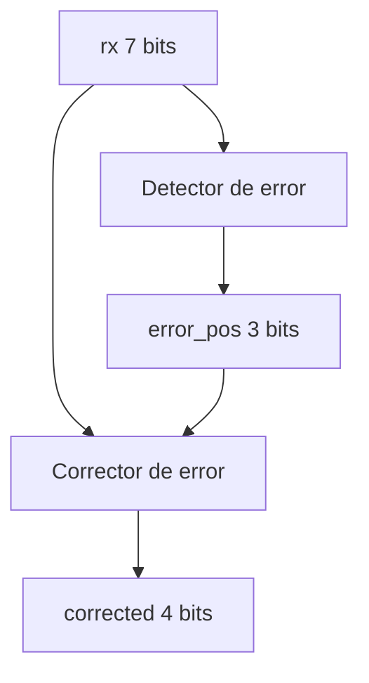
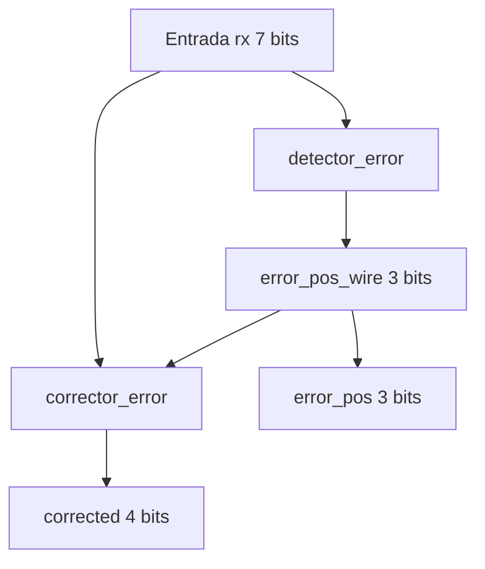
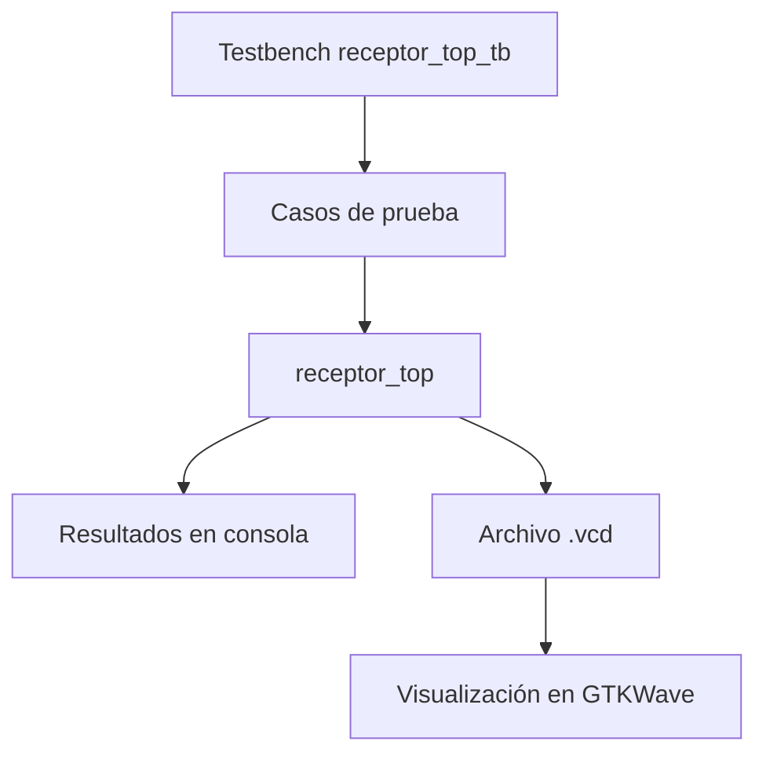

# Proyecto corto I – Diseño digital combinacional en dispositivos programables

## Escuela de Ingeniería Electrónica
**Curso:** EL-3307 Diseño Lógico  

**Semestre:** I Semestre 2026  

**Profesor:** Oscar Caravaca

--- 
## Integrantes
- Gabriel Alonso Chavarría Rodriguez
- Mariana Guerrero Morales
---
## Abreviaturas y definiciones
- **FPGA**: Field Programmable Gate Arrays
- **HDL**: Hardware Description Language
- **SCR**: Silicon Controlled Rectifier
- **EDA**: Electronic Design Automation
- **GPIO**: General Purpose Input/Output
---
## Herramientas Utilizadas
- **Descripción Hardawre**: SystemVerilog
- **herramientas de simulación**:
- **GTKwave**: Verificación gráfica de señales mediante simulación.
---
## Referencias


---
## Objetivo
Implementar y validar un sistema receptor basado en el código Hamming (7,4) mediante lógica programable en una FPGA Tang Nano 9k, integrando módulos de detección y corrección de errores de un bit, con el fin de garantizar la integridad de la información recibida y su correcta visualización en interfaces físicas binarias y hexadecimales.

---
# Descripción General

El presente proyecto tiene como objetivo el diseño e implementación de un sistema digital basado en el código Hamming (7,4), utilizando una FPGA como plataforma de desarrollo. El sistema completo se divide en dos grandes bloques: transmisor y receptor. El transmisor se encarga de tomar una palabra de 4 bits, codificarla en una palabra de 7 bits e introducir un error controlado si así se desea. El receptor, por su parte, recibe la palabra de 7 bits, detecta si existe error, determina la posición del bit erróneo y recupera la palabra original de 4 bits.

Hasta esta etapa del desarrollo, se ha trabajado principalmente en el **subsistema receptor**, incluyendo su organización modular, la integración de sus componentes, la simulación funcional mediante testbench y la verificación del comportamiento temporal de las señales. Además, se reorganizó la estructura general del proyecto para mantener una mejor separación entre documentación, diseño, simulación y archivos de compilación.

El trabajo realizado hasta el momento constituye una base importante para continuar con las siguientes etapas del proyecto, como la visualización en LEDs, el despliegue en 7 segmentos, la integración con el transmisor y la implementación final sobre hardware.

---
## Estructura actual del proyecto
Se reorganizó la estructura del proyecto con el fin de separar adecuadamente la documentación, el diseño HDL, la simulación, los constraints y los archivos generados durante compilación.
```text
Proyecto_1
├── docs
│   ├── imagenes
│   └── informe
├── src
│   ├── build
│   │   ├── Makefile
│   │   ├── receptor_test.o
│   │   └── receptor_top_tb.vcd
│   ├── constr
│   │   ├── constr_Plantilla.txt
│   │   └── receptor.cst
│   ├── design
│   │   ├── receptor
│   │   │   ├── detector_error.sv
│   │   │   ├── corrector_error.sv
│   │   │   ├── receptor_top.sv
│   │   │   └── README.md
│   │   └── transmisor
│   └── sim
│       └── receptor_top_tb.sv
├── .gitignore
└── README.md
```
La estructura actual del proyecto se compone de carpetas principales como:

- `docs`, para documentación e imágenes,
- `src/build`, para compilación y archivos generados,
- `src/constr`, para constraints,
- `src/design`, para módulos del transmisor y receptor,
- `src/sim`, para archivos de simulación.

Esta organización permite mantener un flujo de trabajo más ordenado, facilita la localización de archivos y mejora la comprensión general del proyecto.

---
## Jerarquía del Subsistema Receptor
# 4. Descripción del subsistema receptor

El receptor desarrollado está compuesto por tres módulos principales:

- 'detector_error'S
- `corrector_error`
- `receptor_top`

La función general del receptor es tomar una palabra codificada de 7 bits y recuperar la información original de 4 bits, incluso si durante la transmisión ocurrió un error de un solo bit.

En el código Hamming (7,4), la palabra transmitida está compuesta por:

- 4 bits de información real,
- 3 bits de paridad.

Por esta razón, aunque la entrada del receptor es de 7 bits, la salida final útil corresponde a 4 bits, ya que esos representan el mensaje original recuperado.

---

# 5. Explicación de los módulos implementados

## 5.1 Módulo detector de error

El módulo `detector_error` se encarga de recibir la palabra codificada de 7 bits y calcular el síndrome correspondiente. Este síndrome se obtiene mediante relaciones de paridad y permite determinar si la palabra contiene error.

Si el síndrome es igual a `000`, se interpreta que no existe error en la palabra recibida. Si el síndrome es distinto de cero, entonces su valor representa la posición del bit erróneo.

Este módulo constituye la primera etapa lógica del receptor, ya que permite decidir si la palabra debe corregirse o no.

---

## 5.2 Módulo corrector de error

El módulo `corrector_error` recibe tanto la palabra de entrada como la posición del error detectado. Si el síndrome indica la existencia de un error, el módulo corrige la palabra invirtiendo el bit correspondiente.

Posteriormente, una vez corregida la palabra, este módulo extrae únicamente los 4 bits de información útil, descartando los bits de paridad.

La función de este módulo es, por lo tanto, recuperar el mensaje original aun cuando se haya alterado un solo bit durante la transmisión.

---

## 5.3 Módulo top del receptor

El módulo `receptor_top` se diseñó como un bloque de integración entre el detector y el corrector. Su objetivo es conectar ambos módulos y permitir una prueba conjunta del funcionamiento del receptor.

Este módulo recibe la palabra de 7 bits, la envía al detector de error, obtiene la posición del bit erróneo y luego utiliza esa información para que el corrector recupere la salida final de 4 bits.

La implementación de este módulo permite trabajar de forma más ordenada y modular, lo cual facilita tanto la simulación como la futura integración del sistema completo.

---
# 6. Simplificación de ecuaciones booleanas

Como parte del análisis lógico del receptor, también se estudió la lógica utilizada en el módulo `detector_error`, ya que este bloque es el encargado de calcular el síndrome de error a partir de la palabra recibida de 7 bits.

En el código Hamming (7,4), el síndrome está compuesto por 3 bits. Estos tres bits permiten determinar si existe un error en la palabra recibida y, en caso de haberlo, ayudan a identificar la posición del bit erróneo.

Cada uno de los bits del síndrome se calcula mediante relaciones de paridad implementadas con compuertas XOR. Esto significa que cada salida revisa un grupo específico de bits de entrada para comprobar si la cantidad de unos es par o impar.

---
## 6.1 Ecuaciones booleanas del detector de error

Las ecuaciones utilizadas en el módulo `detector_error` son las siguientes:

- `error_pos[0] = rx[0] ⊕ rx[2] ⊕ rx[4] ⊕ rx[6]`
- `error_pos[1] = rx[1] ⊕ rx[2] ⊕ rx[5] ⊕ rx[6]`
- `error_pos[2] = rx[3] ⊕ rx[4] ⊕ rx[5] ⊕ rx[6]`

Estas ecuaciones corresponden al cálculo del síndrome del código Hamming (7,4). Cada una revisa un conjunto específico de bits de la palabra recibida para comprobar si la paridad esperada se mantiene.
## 6.2 Ejemplo de análisis y simplificación

Tomando como ejemplo la primera ecuación del síndrome:

```text
error_pos[0] = rx[0] ⊕ rx[2] ⊕ rx[4] ⊕ rx[6]
```

Esta ecuación sirve para revisar si existe un error dentro de ese grupo de bits. La operación XOR es útil porque permite comparar la paridad de varios bits al mismo tiempo.

Su funcionamiento puede interpretarse de forma sencilla así:\
Si la cantidad de bits en 1 dentro de ese grupo es par, la salida será 0, si la cantidad de bits en 1 dentro de ese grupo es impar, la salida será 1.Eso significa que esta ecuación está comprobando si la paridad se conserva como debería. Si el resultado no coincide con lo esperado, entonces se detecta que existe una alteración en esa parte de la palabra recibida.

Desde el punto de vista lógico, esta expresión ya se considera simplificada, ya que el uso de XOR representa directamente la función de verificación de paridad. Por esa razón, no es necesario expandirla a una forma más larga o complicada, porque hacerlo no aportaría una implementación más eficiente.

## 6.3 Ejemplo de ecuación booleana del circuito corrector de error

Además del detector de error, también es posible analizar la lógica utilizada en el bloque corrector. La función principal de este módulo es invertir únicamente el bit que fue identificado como erróneo por el síndrome.

Un ejemplo sencillo se puede observar en la corrección del primer bit útil de salida, el cual proviene originalmente de la posición `rx[2]` de la palabra recibida.

La lógica de corrección puede expresarse como:

```text
corrected[0] = rx[2] ⊕ e3
```
donde e3 representa una señal de control que vale:
- e3 = 1  si error_pos = 3
- e3 = 0  en cualquier otro caso

Esta ecuación significa lo siguiente:

si el error detectado está en la posición 3, entonces e3 = 1, por lo que el bit se invierte;
si el error no está en esa posición, entonces e3 = 0, por lo que el bit permanece igual.

Esto ocurre porque la compuerta XOR tiene la propiedad de:
dejar el bit igual cuando se opera con 0,
invertir el bit cuando se opera con 1.

Por lo tanto, esta expresión representa de forma directa y simplificada la lógica del corrector de error, ya que permite corregir el bit únicamente cuando corresponde.

Desde el punto de vista del diseño, esta ecuación es una forma intuitiva de modelar la corrección: el bit de salida será igual al bit recibido, excepto cuando el sistema detecta que justamente ese bit fue el que llegó alterado.

---
## 6.4 Interpretación funcional

El detector de error utiliza estas ecuaciones para construir el síndrome completo de 3 bits. La combinación de esos tres bits permite determinar si la palabra recibida tiene error y en qué posición se encuentra.

Por ejemplo:

si el síndrome es 000, se interpreta que la palabra no tiene error,
si el síndrome es distinto de 000, entonces ese valor binario indica la posición del bit erróneo.

De esta forma, el detector no solo verifica si la palabra está correcta, sino que también proporciona la información necesaria para que el módulo corrector pueda invertir el bit incorrecto y recuperar la palabra original.

---

## 6.5 Trabajo pendiente para etapas futuras

Como parte de las siguientes etapas del proyecto, se incluirán además:

la simplificación de ecuaciones booleanas asociadas al circuito corrector de error,
la lógica de salida para LEDs,
y la lógica de visualización en 7 segmentos.

Estas secciones serán incorporadas una vez se complete la implementación de dichos subsistemas, de manera que el informe final cubra todos los requerimientos establecidos en la guía del proyecto.

---
# 7. Simulación funcional del receptor

Con el fin de verificar el funcionamiento del receptor antes de implementarlo en hardware, se desarrolló un archivo de simulación llamado `receptor_top_tb.sv`, el cual actúa como **testbench** del sistema.

El objetivo del testbench fue probar distintos casos de entrada para observar si el receptor:

- detectaba correctamente la presencia o ausencia de error,
- identificaba la posición del bit erróneo,
- y recuperaba correctamente la palabra original de 4 bits.

Para ello, se utilizaron distintos patrones de entrada, incluyendo palabras correctas y palabras con errores en diferentes posiciones.

---

# 8. Resultados obtenidos en consola

Durante la simulación se utilizó el comando `make test`, obteniéndose en consola una salida donde se mostraron los principales resultados de cada caso de prueba.

En cada línea de salida se visualizaron los siguientes elementos:

- la palabra recibida (`rx`),
- la posición del error detectado (`error_pos`),
- y la palabra corregida (`corrected`).

Los resultados mostraron que el sistema fue capaz de:

- detectar correctamente cuándo no existía error,
- identificar la posición del bit erróneo cuando sí existía error,
- y recuperar la palabra original de 4 bits.

Esto permitió comprobar que el diseño del receptor funciona adecuadamente para los casos de prueba implementados.

---

# 9. Verificación gráfica en GTKWave

Además de la salida en consola, se generó un archivo `.vcd` a partir del testbench, el cual fue abierto en GTKWave para observar el comportamiento temporal de las señales.

En GTKWave se visualizaron principalmente las siguientes señales:

- `rx[6:0]`
- `error_pos[2:0]`
- `corrected[3:0]`

La observación de estas señales permitió comprobar de forma gráfica que:

- la entrada cambia según cada caso de prueba,
- el detector genera correctamente el síndrome,
- y el corrector mantiene la salida esperada.

Esta validación gráfica es importante porque confirma visualmente el comportamiento lógico del diseño, más allá de los resultados mostrados en texto por la consola.

---

# 10. Makefile y flujo de trabajo

Como parte del avance, también se preparó el archivo `Makefile`, el cual permite automatizar tareas del proyecto como:

- compilación del diseño,
- simulación funcional,
- generación del archivo `.vcd`,
- y visualización de resultados.

El flujo utilizado hasta esta etapa fue el siguiente:

1. Organización de los archivos del diseño.
2. Integración del testbench.
3. Ejecución de simulación con `make test`.
4. Generación del archivo de ondas.
5. Visualización del comportamiento en GTKWave.

Esto facilitó considerablemente el proceso de prueba y verificación del receptor.

---

# 11. Archivo de constraints

Se incorporó también el archivo `receptor.cst`, basado en la plantilla de constraints brindada en el curso. Este archivo permite dejar preparada la asignación de pines para futuras etapas del proyecto, cuando el diseño sea probado directamente sobre la FPGA.

Aunque en esta etapa el enfoque principal fue la simulación funcional, la inclusión temprana del archivo de constraints forma parte de una correcta organización del proyecto.

---

# 12. Diagramas de bloques

Con el fin de cumplir con la guía de diseño del proyecto, se desarrollaron diagramas de bloques que representan la estructura del receptor, la interconexión entre módulos y el flujo de verificación utilizado.

Estos diagramas permiten visualizar de manera más clara la relación entre la palabra de entrada, la detección de error, la corrección y la salida final del sistema.

## **DIAGRAMA 1 – Receptor General**


## **DIAGRAMA 2 – Estructura del módulo top**


## **DIAGRAMA 3 – Flujo de verificación**

    
---
# 13. Estado actual del proyecto

Hasta esta etapa se han completado los siguientes avances:

---
- reorganización de la estructura del proyecto,
- creación y ajuste del `Makefile`,
- incorporación del archivo `receptor.cst`,
- implementación del módulo detector de error,
- implementación del módulo corrector de error,
- integración de ambos en `receptor_top`,
- creación del testbench,
- simulación funcional en consola,
- y verificación gráfica en GTKWave.

Entre los elementos pendientes para etapas posteriores se encuentran:

- despliegue de salida en LEDs,
- despliegue en 7 segmentos,
- integración con el selector,
- integración completa con el transmisor,
- pruebas físicas en protoboard,
- y carga final en FPGA.

---

# 14. Problemas encontrados y soluciones aplicadas

Durante el desarrollo del subsistema receptor se presentaron varios inconvenientes relacionados con:

- la organización inicial del repositorio,
- la configuración del entorno de simulación,
- la instalación de herramientas del entorno OSS CAD Suite,
- y la ubicación de archivos generados por la simulación.

Estos problemas fueron resueltos mediante:

- reorganización de carpetas,
- corrección del flujo del `Makefile`,
- configuración adecuada de herramientas,
- y validación paso a paso de la simulación.

Este proceso permitió no solo avanzar técnicamente en el proyecto, sino también mejorar la comprensión general del flujo de trabajo del diseño digital.

---

# 15. Conclusiones 


---
